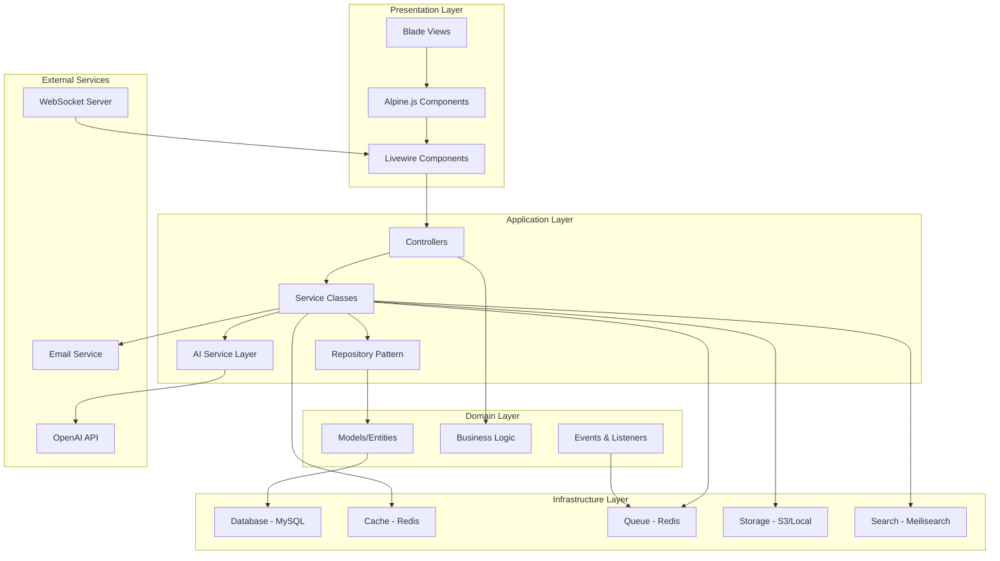
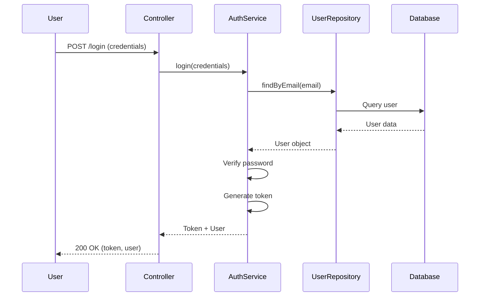
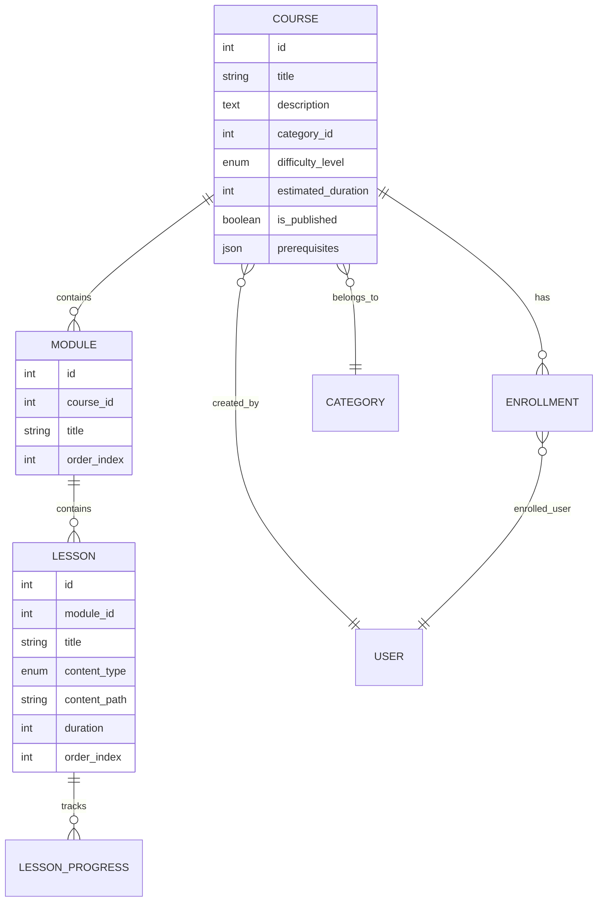
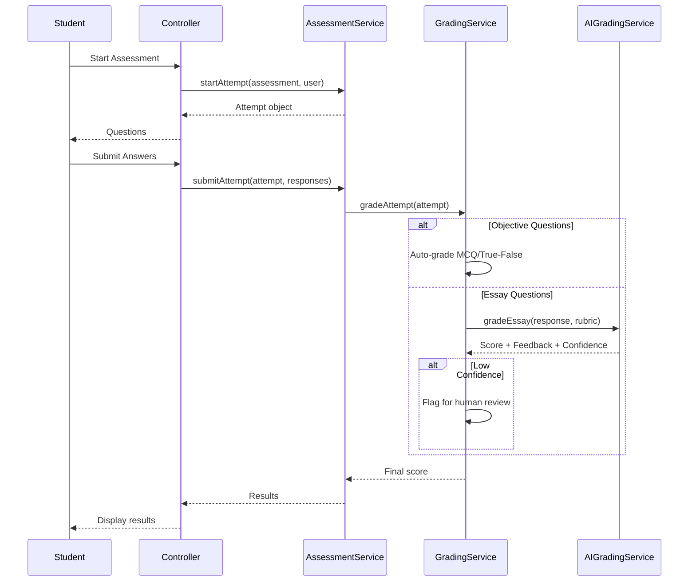
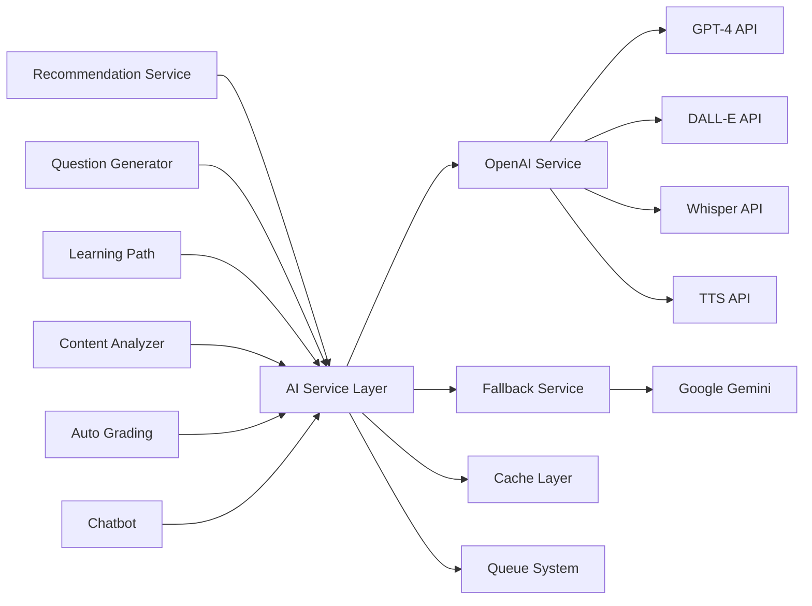
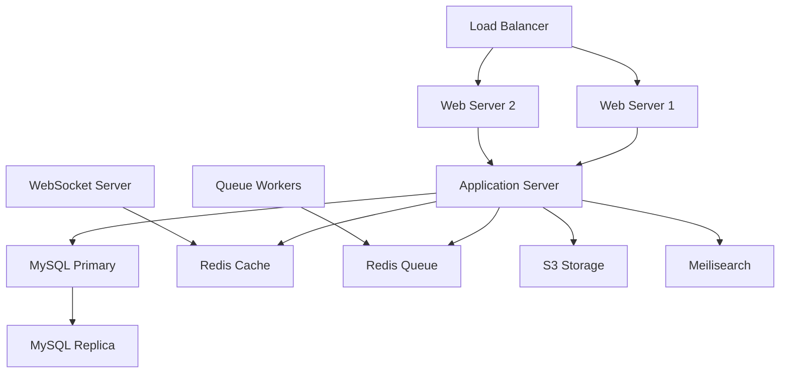

# Design Document

## Overview

The AI-Powered Corporate LMS is a comprehensive enterprise learning platform built on Laravel 11 with a modern frontend stack. The system architecture follows a monolithic approach with clear separation of concerns using Laravel's MVC pattern, enhanced with service-oriented architecture for complex business logic and AI integrations.

### Technology Stack

**Backend:**
- Laravel 11 (PHP 8.2+)
- MySQL 8.0+ with optimized indexing
- Redis for caching and queue management
- Laravel Sanctum for API authentication
- Laravel Horizon for queue monitoring
- Laravel Scout with Meilisearch for full-text search
- Laravel WebSockets for real-time features

**Frontend:**
- Laravel Blade templating engine
- Alpine.js for reactive components
- Tailwind CSS for styling
- Livewire for dynamic interactions
- Chart.js for analytics visualization
- Video.js for video playback
- Dropzone.js for file uploads

**AI Services:**
- OpenAI GPT-4 API for content generation and analysis
- OpenAI DALL-E 3 for image generation
- OpenAI Whisper for speech-to-text
- OpenAI TTS for text-to-speech
- Custom AI service layer for abstraction and fallback handling

### Design Principles

1. **Modularity**: Each feature is encapsulated in its own module with clear boundaries
2. **Scalability**: Queue-based processing for heavy operations, caching for performance
3. **Maintainability**: Service classes for business logic, repositories for data access
4. **Security**: Role-based access control, input validation, SQL injection prevention
5. **User Experience**: Responsive design, progressive enhancement, accessibility compliance

## Architecture

### High-Level Architecture




### Directory Structure

```
app/
├── Console/
│   └── Commands/          # Artisan commands
├── Events/                # Domain events
├── Exceptions/            # Custom exceptions
├── Http/
│   ├── Controllers/       # Request handlers
│   │   ├── Admin/
│   │   ├── Api/
│   │   ├── Instructor/
│   │   └── Student/
│   ├── Middleware/        # Request middleware
│   ├── Requests/          # Form requests with validation
│   └── Resources/         # API resources
├── Jobs/                  # Queue jobs
├── Listeners/             # Event listeners
├── Models/                # Eloquent models
├── Notifications/         # Notification classes
├── Policies/              # Authorization policies
├── Providers/             # Service providers
├── Repositories/          # Data access layer
│   ├── Contracts/         # Repository interfaces
│   └── Eloquent/          # Eloquent implementations
├── Services/              # Business logic services
│   ├── AI/                # AI-related services
│   ├── Course/            # Course management
│   ├── Assessment/        # Assessment services
│   ├── Certificate/       # Certificate generation
│   └── Analytics/         # Analytics services
└── View/
    └── Components/        # Blade components

resources/
├── css/
│   └── app.css           # Tailwind CSS
├── js/
│   ├── app.js            # Main JS entry
│   ├── alpine/           # Alpine.js components
│   └── utils/            # Utility functions
└── views/
    ├── components/       # Reusable Blade components
    ├── layouts/          # Layout templates
    ├── admin/            # Admin views
    ├── instructor/       # Instructor views
    ├── student/          # Student views
    └── livewire/         # Livewire components

database/
├── factories/            # Model factories
├── migrations/           # Database migrations
└── seeders/              # Database seeders
```

## Components and Interfaces

### 1. Authentication & Authorization Module

**Components:**
- `AuthController`: Handles login, registration, logout
- `UserService`: User management business logic
- `RoleService`: Role and permission management
- `UserRepository`: Data access for users

**Key Interfaces:**

```php
interface UserRepositoryInterface
{
    public function create(array $data): User;
    public function findByEmail(string $email): ?User;
    public function updateProfile(User $user, array $data): User;
    public function assignRole(User $user, string $role): void;
    public function getUsersByDepartment(int $departmentId): Collection;
}

interface AuthServiceInterface
{
    public function login(array $credentials): array;
    public function register(array $data): User;
    public function logout(User $user): void;
    public function enable2FA(User $user): array;
    public function verify2FA(User $user, string $code): bool;
}
```

**Authentication Flow:**




### 2. Course Management Module

**Components:**
- `CourseController`: Course CRUD operations
- `CourseService`: Course business logic
- `CourseRepository`: Course data access
- `ModuleService`: Module management
- `LessonService`: Lesson management
- `CourseBuilderService`: Visual course builder logic

**Key Interfaces:**

```php
interface CourseRepositoryInterface
{
    public function create(array $data): Course;
    public function update(Course $course, array $data): Course;
    public function findWithModules(int $id): Course;
    public function search(array $filters): LengthAwarePaginator;
    public function getPublished(): Collection;
    public function getMandatoryForUser(User $user): Collection;
}

interface CourseServiceInterface
{
    public function createCourse(array $data, User $creator): Course;
    public function updateCourse(Course $course, array $data): Course;
    public function publishCourse(Course $course): void;
    public function cloneCourse(Course $course): Course;
    public function addModule(Course $course, array $data): Module;
    public function reorderModules(Course $course, array $order): void;
}
```

**Course Structure:**




### 3. Content Delivery Module

**Components:**
- `ContentController`: Content serving
- `ContentService`: Content processing and delivery
- `ProgressTrackingService`: Progress management
- `VideoStreamingService`: Video delivery optimization
- `ContentRecommendationService`: Content suggestions

**Key Interfaces:**

```php
interface ContentServiceInterface
{
    public function getLesson(int $lessonId, User $user): array;
    public function trackProgress(User $user, Lesson $lesson, array $data): void;
    public function bookmarkPosition(User $user, Lesson $lesson, int $position): void;
    public function markComplete(User $user, Lesson $lesson): void;
    public function getDownloadUrl(Lesson $lesson, User $user): string;
}

interface ProgressTrackingServiceInterface
{
    public function updateProgress(Enrollment $enrollment): void;
    public function getProgress(Enrollment $enrollment): array;
    public function calculateCourseCompletion(Enrollment $enrollment): float;
}
```

### 4. Assessment Module

**Components:**
- `AssessmentController`: Assessment management
- `AssessmentService`: Assessment business logic
- `QuestionService`: Question management
- `AttemptService`: Attempt handling
- `GradingService`: Grading logic

**Key Interfaces:**

```php
interface AssessmentServiceInterface
{
    public function createAssessment(array $data): Assessment;
    public function addQuestion(Assessment $assessment, array $data): Question;
    public function startAttempt(Assessment $assessment, User $user): Attempt;
    public function submitAttempt(Attempt $attempt, array $responses): void;
    public function gradeAttempt(Attempt $attempt): float;
}

interface QuestionServiceInterface
{
    public function createQuestion(array $data): Question;
    public function addOption(Question $question, array $data): QuestionOption;
    public function validateResponse(Question $question, $response): bool;
    public function getRandomQuestions(Assessment $assessment, int $count): Collection;
}
```

**Assessment Flow:**




### 5. AI Services Module

**Components:**
- `AIServiceProvider`: AI service abstraction
- `OpenAIService`: OpenAI API integration
- `AIRecommendationService`: Content recommendations
- `AIQuestionGeneratorService`: Question generation
- `AILearningPathService`: Learning path optimization
- `AIContentAnalyzerService`: Content analysis
- `AIGradingService`: Auto-grading
- `AIChatbotService`: Chatbot functionality

**Key Interfaces:**

```php
interface AIServiceInterface
{
    public function generateText(string $prompt, array $options = []): string;
    public function analyzeText(string $text, string $task): array;
    public function generateImage(string $prompt): string;
    public function transcribeAudio(string $audioPath): string;
    public function textToSpeech(string $text): string;
}

interface AIRecommendationServiceInterface
{
    public function generateRecommendations(User $user): array;
    public function getPersonalizedCourses(User $user, int $limit): Collection;
    public function analyzeSkillGaps(User $user): array;
    public function recordFeedback(Recommendation $rec, string $action): void;
}

interface AIQuestionGeneratorServiceInterface
{
    public function generateQuestions(string $content, array $params): array;
    public function generateFromLesson(Lesson $lesson, array $params): Job;
    public function reviewGeneratedQuestion(GeneratedQuestion $question, bool $approve): void;
}

interface AILearningPathServiceInterface
{
    public function generateLearningPath(User $user, string $targetRole): LearningPath;
    public function optimizePath(LearningPath $path): void;
    public function adjustPath(LearningPath $path, array $performance): void;
}

interface AIContentAnalyzerServiceInterface
{
    public function analyzeReadability(string $content): array;
    public function identifyGaps(Course $course): array;
    public function generateSuggestions(Course $course): array;
    public function checkAccessibility(string $content): array;
}

interface AIGradingServiceInterface
{
    public function gradeEssay(string $response, array $rubric): array;
    public function generateFeedback(string $response, array $analysis): string;
    public function calculateConfidence(array $analysis): float;
}

interface AIChatbotServiceInterface
{
    public function processMessage(string $message, User $user, array $context): string;
    public function detectIntent(string $message): string;
    public function searchKnowledgeBase(string $query): array;
    public function generateResponse(string $message, array $context): string;
}
```

**AI Service Architecture:**




### 6. Certificate Module

**Components:**
- `CertificateController`: Certificate management
- `CertificateService`: Certificate generation
- `TemplateService`: Template management
- `VerificationService`: Certificate verification

**Key Interfaces:**

```php
interface CertificateServiceInterface
{
    public function generate(Enrollment $enrollment): Certificate;
    public function generateBulk(Collection $enrollments): Collection;
    public function sendEmail(Certificate $certificate): void;
    public function verify(string $certificateNumber): ?Certificate;
    public function generateQRCode(Certificate $certificate): string;
}

interface TemplateServiceInterface
{
    public function create(array $data): CertificateTemplate;
    public function render(CertificateTemplate $template, array $data): string;
    public function convertToPDF(string $html): string;
}
```

### 7. Analytics & Reporting Module

**Components:**
- `AnalyticsController`: Analytics endpoints
- `AnalyticsService`: Analytics processing
- `ReportService`: Report generation
- `DashboardService`: Dashboard data aggregation

**Key Interfaces:**

```php
interface AnalyticsServiceInterface
{
    public function trackEvent(string $eventType, User $user, array $properties): void;
    public function getUserAnalytics(User $user): array;
    public function getCourseAnalytics(Course $course): array;
    public function getDepartmentAnalytics(Department $dept): array;
    public function getComplianceReport(array $filters): array;
}

interface ReportServiceInterface
{
    public function generateReport(string $type, array $params): Report;
    public function scheduleReport(string $type, array $params, string $schedule): void;
    public function exportReport(Report $report, string $format): string;
}
```

## Data Models

### Core Models

**User Model:**
```php
class User extends Authenticatable
{
    protected $fillable = [
        'name', 'email', 'password', 'role', 'department_id',
        'position', 'avatar', 'phone', 'bio', 'preferences'
    ];
    
    protected $casts = [
        'preferences' => 'array',
        'email_verified_at' => 'datetime',
        'last_login_at' => 'datetime',
    ];
    
    // Relationships
    public function department(): BelongsTo;
    public function enrollments(): HasMany;
    public function createdCourses(): HasMany;
    public function certificates(): HasMany;
    public function assessmentAttempts(): HasMany;
    public function recommendations(): HasMany;
    public function learningPaths(): HasMany;
    public function chatbotConversations(): HasMany;
}
```

**Course Model:**
```php
class Course extends Model
{
    protected $fillable = [
        'title', 'slug', 'description', 'short_description',
        'category_id', 'difficulty_level', 'estimated_duration',
        'thumbnail', 'preview_video', 'price', 'is_mandatory',
        'is_published', 'is_featured', 'prerequisites',
        'learning_objectives', 'target_audience', 'language',
        'tags', 'metadata', 'created_by'
    ];
    
    protected $casts = [
        'prerequisites' => 'array',
        'learning_objectives' => 'array',
        'tags' => 'array',
        'metadata' => 'array',
        'is_mandatory' => 'boolean',
        'is_published' => 'boolean',
        'is_featured' => 'boolean',
    ];
    
    // Relationships
    public function category(): BelongsTo;
    public function creator(): BelongsTo;
    public function modules(): HasMany;
    public function enrollments(): HasMany;
    public function assessments(): HasMany;
    public function recommendations(): HasMany;
    public function contentAnalysis(): HasMany;
}
```

**Enrollment Model:**
```php
class Enrollment extends Model
{
    protected $table = 'course_enrollments';
    
    protected $fillable = [
        'course_id', 'user_id', 'enrollment_type', 'enrolled_by',
        'deadline', 'status', 'completion_date', 'final_score',
        'certificate_id', 'progress_percentage', 'last_accessed_at'
    ];
    
    protected $casts = [
        'enrollment_date' => 'datetime',
        'deadline' => 'datetime',
        'completion_date' => 'datetime',
        'last_accessed_at' => 'datetime',
        'final_score' => 'decimal:2',
        'progress_percentage' => 'decimal:2',
    ];
    
    // Relationships
    public function course(): BelongsTo;
    public function user(): BelongsTo;
    public function enrolledBy(): BelongsTo;
    public function certificate(): BelongsTo;
    public function lessonProgress(): HasMany;
}
```


**Assessment Model:**
```php
class Assessment extends Model
{
    protected $fillable = [
        'course_id', 'title', 'description', 'instructions',
        'passing_score', 'time_limit', 'max_attempts',
        'randomize_questions', 'randomize_options',
        'show_results', 'show_correct_answers', 'allow_review',
        'is_published', 'created_by'
    ];
    
    protected $casts = [
        'passing_score' => 'decimal:2',
        'randomize_questions' => 'boolean',
        'randomize_options' => 'boolean',
        'show_results' => 'boolean',
        'show_correct_answers' => 'boolean',
        'allow_review' => 'boolean',
        'is_published' => 'boolean',
    ];
    
    // Relationships
    public function course(): BelongsTo;
    public function questions(): HasMany;
    public function attempts(): HasMany;
    public function creator(): BelongsTo;
}
```

## Error Handling

### Error Handling Strategy

1. **Exception Hierarchy:**
```php
// Base exception
class LMSException extends Exception {}

// Domain-specific exceptions
class CourseNotFoundException extends LMSException {}
class EnrollmentException extends LMSException {}
class AssessmentException extends LMSException {}
class AIServiceException extends LMSException {}
class CertificateGenerationException extends LMSException {}
```

2. **Global Exception Handler:**
```php
class Handler extends ExceptionHandler
{
    public function render($request, Throwable $exception)
    {
        if ($exception instanceof LMSException) {
            return $this->handleLMSException($request, $exception);
        }
        
        if ($exception instanceof ValidationException) {
            return $this->handleValidationException($request, $exception);
        }
        
        if ($exception instanceof AuthenticationException) {
            return $this->handleAuthenticationException($request, $exception);
        }
        
        return parent::render($request, $exception);
    }
    
    protected function handleLMSException($request, LMSException $exception)
    {
        if ($request->expectsJson()) {
            return response()->json([
                'error' => $exception->getMessage(),
                'code' => $exception->getCode()
            ], 400);
        }
        
        return back()->with('error', $exception->getMessage());
    }
}
```

3. **API Error Responses:**
```php
// Standardized error response format
{
    "success": false,
    "error": {
        "code": "COURSE_NOT_FOUND",
        "message": "The requested course does not exist",
        "details": {}
    }
}
```

4. **Logging Strategy:**
- Critical errors: Database failures, AI service failures
- Warnings: Failed login attempts, validation errors
- Info: User actions, course completions
- Debug: API calls, query performance

### AI Service Error Handling

```php
class OpenAIService implements AIServiceInterface
{
    public function generateText(string $prompt, array $options = []): string
    {
        try {
            $response = $this->client->chat()->create([
                'model' => 'gpt-4',
                'messages' => [['role' => 'user', 'content' => $prompt]],
                ...$options
            ]);
            
            return $response->choices[0]->message->content;
            
        } catch (RateLimitException $e) {
            Log::warning('OpenAI rate limit reached', ['prompt' => $prompt]);
            throw new AIServiceException('AI service temporarily unavailable');
            
        } catch (ApiException $e) {
            Log::error('OpenAI API error', ['error' => $e->getMessage()]);
            
            // Fallback to alternative service
            return $this->fallbackService->generateText($prompt, $options);
            
        } catch (Exception $e) {
            Log::critical('Unexpected AI service error', ['error' => $e->getMessage()]);
            throw new AIServiceException('Failed to generate AI response');
        }
    }
}
```

## Testing Strategy

### Testing Pyramid

1. **Unit Tests (70%)**
   - Service classes
   - Repository classes
   - Helper functions
   - Model methods

2. **Integration Tests (20%)**
   - API endpoints
   - Database interactions
   - External service integrations
   - Queue jobs

3. **Feature Tests (10%)**
   - Complete user workflows
   - Authentication flows
   - Course enrollment and completion
   - Assessment taking and grading

### Test Examples

**Unit Test - CourseService:**
```php
class CourseServiceTest extends TestCase
{
    use RefreshDatabase;
    
    public function test_create_course_with_valid_data()
    {
        $user = User::factory()->create(['role' => 'instructor']);
        $service = app(CourseService::class);
        
        $data = [
            'title' => 'Test Course',
            'description' => 'Test Description',
            'category_id' => 1,
            'difficulty_level' => 'beginner'
        ];
        
        $course = $service->createCourse($data, $user);
        
        $this->assertInstanceOf(Course::class, $course);
        $this->assertEquals('Test Course', $course->title);
        $this->assertEquals($user->id, $course->created_by);
    }
    
    public function test_publish_course_updates_status()
    {
        $course = Course::factory()->create(['is_published' => false]);
        $service = app(CourseService::class);
        
        $service->publishCourse($course);
        
        $this->assertTrue($course->fresh()->is_published);
    }
}
```

**Feature Test - Course Enrollment:**
```php
class CourseEnrollmentTest extends TestCase
{
    use RefreshDatabase;
    
    public function test_user_can_enroll_in_course()
    {
        $user = User::factory()->create();
        $course = Course::factory()->create(['is_published' => true]);
        
        $response = $this->actingAs($user)
            ->post("/courses/{$course->id}/enroll");
        
        $response->assertRedirect();
        $this->assertDatabaseHas('course_enrollments', [
            'user_id' => $user->id,
            'course_id' => $course->id,
            'status' => 'active'
        ]);
    }
}
```

**Integration Test - AI Service:**
```php
class AIRecommendationServiceTest extends TestCase
{
    public function test_generates_recommendations_for_user()
    {
        Http::fake([
            'api.openai.com/*' => Http::response([
                'choices' => [
                    ['message' => ['content' => json_encode([
                        ['course_id' => 1, 'score' => 0.95, 'reason' => 'Test']
                    ])]]
                ]
            ])
        ]);
        
        $user = User::factory()->create();
        $service = app(AIRecommendationService::class);
        
        $recommendations = $service->generateRecommendations($user);
        
        $this->assertIsArray($recommendations);
        $this->assertNotEmpty($recommendations);
    }
}
```

### Testing AI Features

For AI-dependent features, use:
- **Mocking**: Mock AI service responses for predictable tests
- **Fixtures**: Use pre-recorded AI responses for integration tests
- **Sandbox**: Test with actual AI APIs in staging environment
- **Monitoring**: Track AI response quality and accuracy in production


## Frontend Design System

### Component Library

**1. Layout Components:**
- `AppLayout`: Main application layout with sidebar
- `GuestLayout`: Layout for authentication pages
- `DashboardLayout`: Dashboard-specific layout
- `Sidebar`: Navigation sidebar with role-based menu
- `Header`: Top navigation bar with user menu
- `Footer`: Application footer

**2. UI Components:**
- `Button`: Multiple variants (primary, secondary, outline, ghost, danger)
- `Card`: Container with shadow and hover effects
- `Modal`: Overlay dialog with backdrop blur
- `Dropdown`: Dropdown menu with animations
- `Tabs`: Tabbed interface component
- `Badge`: Status and label badges
- `Alert`: Notification alerts (success, error, warning, info)
- `Toast`: Auto-dismissing notifications
- `Tooltip`: Hover tooltips
- `Spinner`: Loading indicators
- `SkeletonLoader`: Content loading placeholders

**3. Form Components:**
- `Input`: Text input with floating labels
- `Textarea`: Multi-line text input
- `Select`: Dropdown select with search
- `Checkbox`: Checkbox with label
- `Radio`: Radio button group
- `FileUpload`: Drag-and-drop file upload
- `DatePicker`: Date selection component
- `TimePicker`: Time selection component
- `RichTextEditor`: WYSIWYG editor for content

**4. Data Display Components:**
- `Table`: Sortable, searchable data table
- `Pagination`: Page navigation
- `Chart`: Chart.js wrapper components
- `ProgressBar`: Progress indicator
- `Avatar`: User avatar with fallback
- `EmptyState`: Empty data placeholder

**5. Course-Specific Components:**
- `CourseCard`: Course display card
- `CourseGrid`: Grid layout for courses
- `VideoPlayer`: Custom video player
- `PDFViewer`: PDF display component
- `LessonList`: Lesson navigation
- `ProgressTracker`: Course progress display

**6. Assessment Components:**
- `QuestionCard`: Question display
- `AnswerOptions`: Answer selection interface
- `Timer`: Assessment timer
- `ResultsDisplay`: Assessment results
- `GradingInterface`: Instructor grading UI

### Design Tokens

**Colors:**
```css
:root {
  /* Primary Colors */
  --color-primary-50: #eff6ff;
  --color-primary-100: #dbeafe;
  --color-primary-500: #3b82f6;
  --color-primary-600: #2563eb;
  --color-primary-700: #1d4ed8;
  --color-primary-900: #1e3a8a;
  
  /* Secondary Colors */
  --color-secondary-500: #10b981;
  --color-secondary-600: #059669;
  
  /* Accent Colors */
  --color-accent-500: #8b5cf6;
  --color-accent-600: #7c3aed;
  
  /* Neutral Colors */
  --color-gray-50: #f8fafc;
  --color-gray-100: #f1f5f9;
  --color-gray-500: #64748b;
  --color-gray-700: #334155;
  --color-gray-900: #0f172a;
  
  /* Semantic Colors */
  --color-success: #10b981;
  --color-warning: #f59e0b;
  --color-error: #ef4444;
  --color-info: #3b82f6;
}
```

**Typography:**
```css
:root {
  --font-family: 'Inter', system-ui, sans-serif;
  
  /* Font Sizes */
  --text-xs: 0.75rem;    /* 12px */
  --text-sm: 0.875rem;   /* 14px */
  --text-base: 1rem;     /* 16px */
  --text-lg: 1.125rem;   /* 18px */
  --text-xl: 1.25rem;    /* 20px */
  --text-2xl: 1.5rem;    /* 24px */
  --text-3xl: 1.875rem;  /* 30px */
  --text-4xl: 2.25rem;   /* 36px */
  
  /* Font Weights */
  --font-normal: 400;
  --font-medium: 500;
  --font-semibold: 600;
  --font-bold: 700;
}
```

**Spacing:**
```css
:root {
  --spacing-1: 0.25rem;  /* 4px */
  --spacing-2: 0.5rem;   /* 8px */
  --spacing-3: 0.75rem;  /* 12px */
  --spacing-4: 1rem;     /* 16px */
  --spacing-6: 1.5rem;   /* 24px */
  --spacing-8: 2rem;     /* 32px */
  --spacing-12: 3rem;    /* 48px */
  --spacing-16: 4rem;    /* 64px */
}
```

### Responsive Breakpoints

```css
/* Mobile First Approach */
/* xs: 0px - 639px (default) */
/* sm: 640px */
@media (min-width: 640px) { }

/* md: 768px */
@media (min-width: 768px) { }

/* lg: 1024px */
@media (min-width: 1024px) { }

/* xl: 1280px */
@media (min-width: 1280px) { }

/* 2xl: 1536px */
@media (min-width: 1536px) { }
```

### Dark Mode Implementation

```javascript
// Alpine.js dark mode toggle
Alpine.store('theme', {
    dark: localStorage.getItem('theme') === 'dark',
    
    toggle() {
        this.dark = !this.dark;
        localStorage.setItem('theme', this.dark ? 'dark' : 'light');
        document.documentElement.classList.toggle('dark', this.dark);
    },
    
    init() {
        document.documentElement.classList.toggle('dark', this.dark);
    }
});
```

### Accessibility Guidelines

1. **Keyboard Navigation:**
   - All interactive elements must be keyboard accessible
   - Logical tab order throughout the application
   - Visible focus indicators

2. **Screen Reader Support:**
   - Semantic HTML elements
   - ARIA labels and roles where needed
   - Alt text for all images

3. **Color Contrast:**
   - Minimum 4.5:1 contrast ratio for normal text
   - Minimum 3:1 for large text
   - Don't rely solely on color to convey information

4. **Form Accessibility:**
   - Labels associated with inputs
   - Error messages clearly announced
   - Required fields indicated

## Security Considerations

### Authentication & Authorization

1. **Password Security:**
   - Bcrypt hashing with cost factor 12
   - Minimum 8 characters, complexity requirements
   - Password reset with time-limited tokens
   - Account lockout after failed attempts

2. **Session Management:**
   - Secure, HTTP-only cookies
   - Session timeout after inactivity
   - CSRF protection on all forms
   - Token rotation on privilege escalation

3. **Role-Based Access Control:**
```php
// Policy example
class CoursePolicy
{
    public function update(User $user, Course $course): bool
    {
        return $user->id === $course->created_by 
            || $user->role === 'admin';
    }
    
    public function delete(User $user, Course $course): bool
    {
        return $user->role === 'admin';
    }
}
```

### Data Protection

1. **Input Validation:**
   - Server-side validation for all inputs
   - Sanitization of user-generated content
   - File upload restrictions (type, size)
   - SQL injection prevention via Eloquent ORM

2. **XSS Prevention:**
   - Blade automatic escaping
   - Content Security Policy headers
   - Sanitize rich text editor content

3. **API Security:**
   - Rate limiting per user/IP
   - API token authentication
   - Request signing for sensitive operations
   - CORS configuration

### AI Service Security

1. **Prompt Injection Prevention:**
   - Input sanitization before AI prompts
   - System message boundaries
   - Output validation and filtering

2. **Data Privacy:**
   - No PII in AI prompts without consent
   - Audit logs for AI interactions
   - Data retention policies

3. **Cost Control:**
   - Rate limiting on AI features
   - Token usage monitoring
   - Fallback to cached responses

## Performance Optimization

### Database Optimization

1. **Indexing Strategy:**
```sql
-- Frequently queried columns
CREATE INDEX idx_courses_published ON courses(is_published);
CREATE INDEX idx_enrollments_user_status ON course_enrollments(user_id, status);
CREATE INDEX idx_lessons_module_order ON course_lessons(module_id, order_index);

-- Full-text search
CREATE FULLTEXT INDEX idx_courses_search ON courses(title, description);

-- Composite indexes for common queries
CREATE INDEX idx_attempts_user_assessment ON assessment_attempts(user_id, assessment_id, status);
```

2. **Query Optimization:**
```php
// Eager loading to prevent N+1 queries
$courses = Course::with(['modules.lessons', 'category', 'creator'])
    ->where('is_published', true)
    ->get();

// Chunking for large datasets
Course::chunk(100, function ($courses) {
    foreach ($courses as $course) {
        // Process course
    }
});
```

### Caching Strategy

1. **Cache Layers:**
```php
// Cache course catalog
Cache::remember('courses.published', 3600, function () {
    return Course::published()->with('category')->get();
});

// Cache user progress
Cache::remember("user.{$userId}.progress", 600, function () use ($userId) {
    return Enrollment::where('user_id', $userId)
        ->with('course')
        ->get();
});

// Cache AI responses
Cache::remember("ai.recommendation.{$userId}", 86400, function () use ($userId) {
    return $this->aiService->generateRecommendations($userId);
});
```

2. **Cache Invalidation:**
```php
// Event listener for cache invalidation
class InvalidateCourseCache
{
    public function handle(CourseUpdated $event)
    {
        Cache::forget('courses.published');
        Cache::forget("course.{$event->course->id}");
    }
}
```

### Queue Optimization

1. **Background Jobs:**
```php
// Heavy operations in queues
dispatch(new GenerateCertificate($enrollment));
dispatch(new ProcessVideoUpload($video));
dispatch(new GenerateAIQuestions($course, $params));
dispatch(new SendBulkNotifications($users, $message));
```

2. **Job Prioritization:**
```php
// High priority queue for user-facing operations
dispatch(new GenerateCertificate($enrollment))->onQueue('high');

// Low priority for analytics
dispatch(new ProcessAnalytics($data))->onQueue('low');
```

### Asset Optimization

1. **Frontend Assets:**
   - Minification of CSS and JavaScript
   - Image optimization and lazy loading
   - CDN for static assets
   - Browser caching headers

2. **Video Delivery:**
   - Adaptive bitrate streaming
   - Video CDN integration
   - Thumbnail generation
   - Progressive download

## Deployment Architecture

### Infrastructure



### Environment Configuration

**Production:**
- Multiple web servers behind load balancer
- Database replication for read scaling
- Redis cluster for cache and queues
- Dedicated queue workers
- CDN for static assets
- Automated backups

**Staging:**
- Single web server
- Separate database
- Shared Redis instance
- AI service sandbox mode

**Development:**
- Local environment with Docker
- SQLite or MySQL
- Local Redis
- Mock AI services

### Monitoring & Logging

1. **Application Monitoring:**
   - Laravel Telescope for debugging
   - Laravel Horizon for queue monitoring
   - Custom health check endpoints
   - Performance metrics tracking

2. **Error Tracking:**
   - Exception logging to files/services
   - AI service failure alerts
   - Database query performance monitoring
   - API response time tracking

3. **Business Metrics:**
   - User engagement analytics
   - Course completion rates
   - Assessment performance
   - AI feature usage statistics
